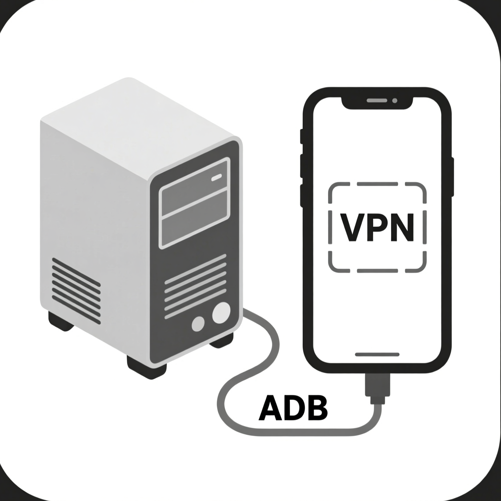
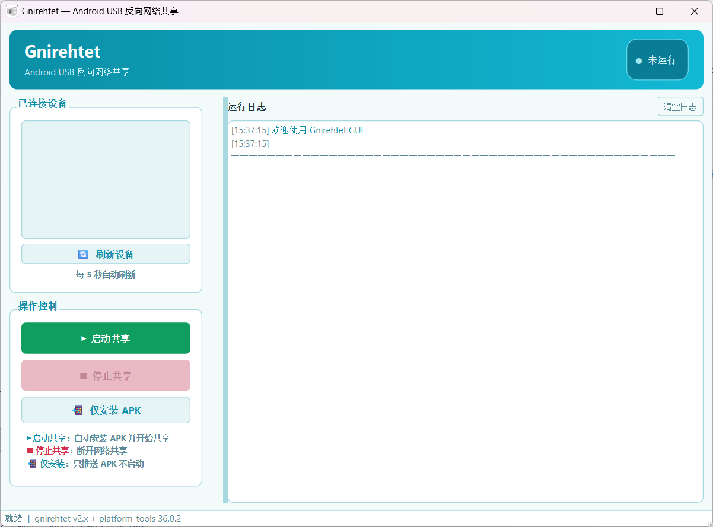

<p align="center">
  
</p>

<h1 align="center">Gnirehtet GUI</h1>

<p align="center">
  A Windows graphical interface for the open-source command-line tool <a href="https://github.com/Genymobile/gnirehtet">gnirehtet</a><br/>
  Android USB reverse tethering · Share your PC's Internet with your phone
</p>

<p align="center">
  <a href="README.md">简体中文</a> · <a href="README_EN.md">English</a>
</p>

<p align="center">
  
  
  
  
</p>

<p align="center">
  
</p>

---

## Introduction

[gnirehtet](https://github.com/Genymobile/gnirehtet) is an open-source reverse tethering command-line tool by Genymobile. Since it only ships with a CLI, it is not friendly to everyday users. **This project is a GUI version of gnirehtet** — the core functionality is still powered by the original `gnirehtet.exe`; this GUI simply wraps it with a friendly interface:

- No commands to memorize — start tethering with a single click
- Automatically detects connected Android devices (refreshes every 5 seconds)
- Target a specific device in multi-device setups
- Real-time, color-coded log output
- Confirmation prompt on exit to avoid accidentally dropping the connection

> Reverse tethering: the opposite of sharing your phone's hotspot with a PC — via a USB cable, your **phone uses the computer's network** to access the Internet. Ideal for debugging, downloads, and flashing in environments without Wi-Fi or mobile data.

## Features

| Feature | Description |
|---------|-------------|
| 🔄 One-click start | Automatically installs gnirehtet.apk on the phone and starts the VPN tunnel |
| ■ One-click stop | Sends the stop command to the phone and terminates the local process |
| 📲 Install only | Pushes the APK to the phone without starting tethering |
| Device management | Auto-detects USB devices and their states (authorized / unauthorized, etc.) |
| Multi-device support | Select a device from the list to target it |
| Live log | Real-time log output with severity-based coloring |

## Getting Started

### Option 1: Use the packaged build (recommended)

Go to the [**Releases**](../../releases) page and download `GnirehtetGUI.exe` (single-file build, no Python installation required).

> If Windows SmartScreen shows "Windows protected your PC" on first launch, click "More info" → "Run anyway".

### Option 2: Run from source

```bash
git clone https://github.com/fengmic/GnirehtetGUI.git
cd GnirehtetGUI

pip install -r requirements.txt
python gnirehtet_gui.py
```

The repository bundles the required binaries (`adb.exe`, `gnirehtet.exe`, `gnirehtet.apk`, etc.), so it runs out of the box after cloning — no extra setup needed.

## Usage

1. On your phone, open **Developer options** → enable **USB debugging** (usually unlocked by tapping "Build number" 7 times in "About phone")
2. Connect the phone to the PC with a USB cable; if the phone shows an "Allow USB debugging?" prompt, tap **Allow**
3. Launch Gnirehtet GUI and wait for your phone to appear in the device list (✅ state)
4. Click **▶ Start**
5. A VPN authorization request will pop up on the phone — tap **OK**
6. Done — your phone's traffic is now routed through the PC

Click **■ Stop** whenever you want to disconnect.

## Building the exe from source

```powershell
.\build_exe.ps1
```

The script installs PyInstaller, generates `icon.ico` from `icon.png`, and bundles `gnirehtet.exe`, `adb.exe`, etc. into `dist\GnirehtetGUI.exe`.

## Project Structure

```
├── gnirehtet_gui.py      # Main application (PySide6 GUI)
├── demo.py               # Image-to-ICO utility (for build icons)
├── build_exe.ps1         # PyInstaller packaging script
├── GnirehtetGUI.spec     # PyInstaller spec
├── requirements.txt      # Python dependencies
├── README.md / README_EN.md  # Docs (Chinese / English)
├── img/screenshot.png    # Screenshot
├── gnirehtet.exe / .apk  # Reverse tethering core (Apache-2.0)
├── adb.exe etc.          # Android platform-tools components (Apache-2.0)
├── icon.png / icon.ico   # App icons
└── THIRD_PARTY_NOTICES.md# Third-party notices
```

## FAQ

**Q: "No ADB devices detected"?**
Check the USB cable (some cables are charge-only), make sure USB debugging is enabled, and confirm you accepted the debugging authorization prompt on the phone.

**Q: Started, but the phone has no Internet?**
Make sure the VPN connection request was accepted on the phone. Some OEM ROMs (e.g. MIUI) require manual confirmation in a background dialog — check the notification shade.

**Q: The VPN icon stays on the phone after stopping?**
Click **■ Stop** again, or manually disconnect the VPN in the phone's system settings.

## Acknowledgements

- [Genymobile / gnirehtet](https://github.com/Genymobile/gnirehtet) — the reverse tethering core (Apache-2.0); this project builds on top of its official binaries
- [Android platform-tools](https://developer.android.com/tools/releases/platform-tools) — ADB components (Apache-2.0)
- [PySide6 / Qt](https://www.qt.io/) — GUI framework

## License

The source code of this project is released under the [MIT License](LICENSE).

The third-party binaries bundled in this repository (gnirehtet, adb, etc.) belong to their respective authors and are licensed under the Apache License 2.0 — see [THIRD_PARTY_NOTICES.md](THIRD_PARTY_NOTICES.md) and [LICENSE-APACHE-2.0.txt](LICENSE-APACHE-2.0.txt).
